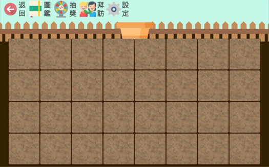
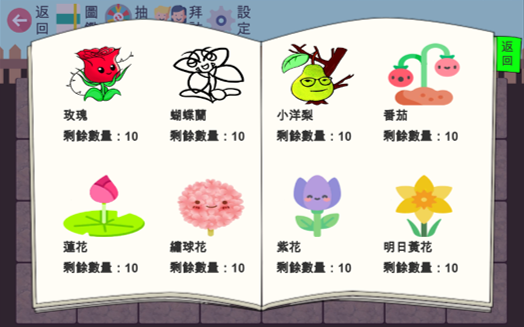
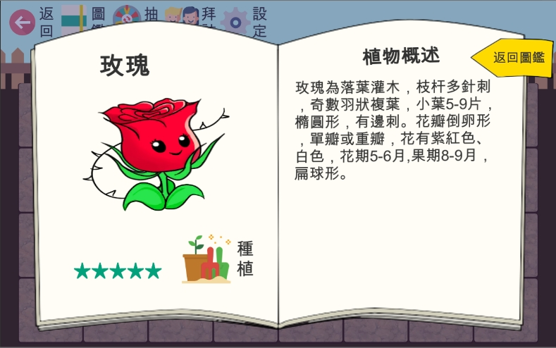
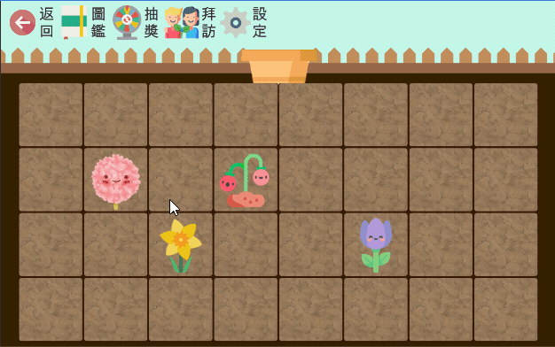
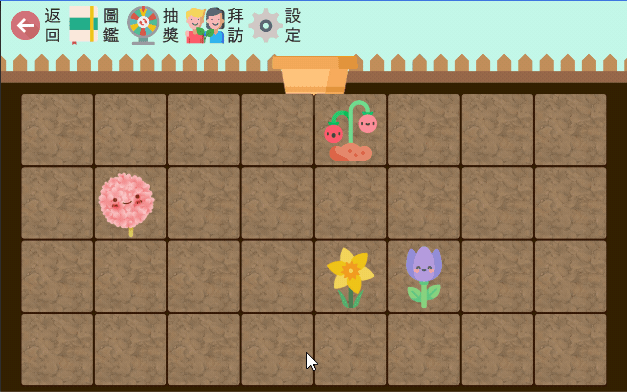
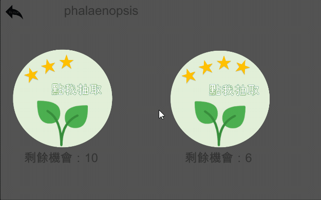

This is a private project from '[c2erichsufjcu/myGarden](https://github.com/c2erichsufjcu/myGarden.git)', which intents to transfer it to public repository.  
cuz I cannot sign in 'c2erichsufjcu', GitHub requires verification via my e-mail, but that e-mail was already deleted. :cry:
****
### 專案描述
大學畢業專題，作為主程式Sporden(復健運動APP)的附屬遊戲化小專案，  
透過在Sporden復健運動後得到點數，使用者可以在遊戲中消耗點數進行抽獎，提供了些許Sporden APP的使用動機。  
此專案使用Unity與C#編寫，並使用AWS SDK及Cognito與主程式的AWS後端串接，將當前的遊戲進度以JSON格式儲存於S3。  
### 專案簡覽
**01[主頁面]**： 進入遊戲後的遊戲畫面，有可種植花朵的格子以及功能列，功能列提供以下按鍵：  
[返回]：返回主程式  
[圖鑑]：呼叫花朵圖鑑介面  
[抽獎]：前往抽獎頁面  
[拜訪]：呼叫可前往朋友花園並查看積分排行的介面  
  

**02[主頁面-花朵圖鑑]**：花園的花朵圖鑑，可以選取已擁有的花朵進入單一花朵圖鑑  
  
  
**03[主頁面-花朵圖鑑-單一花朵圖鑑]**：有關於花朵的描述，並有可以將花朵呼叫出放置在花園主頁面格子的功能按鍵  
  
  
**04**：花朵圖鑑呼叫花朵至主畫面種植演示  
  
  
**05**：花朵回收倉庫和取消移動操作演示  
  
  
**06[主頁面-抽獎]**：花朵抽獎演示  
  
  
###### * 部分素材元件來自[flaticon](https://www.flaticon.com/)，其餘素材、動圖皆為自製或自繪  
